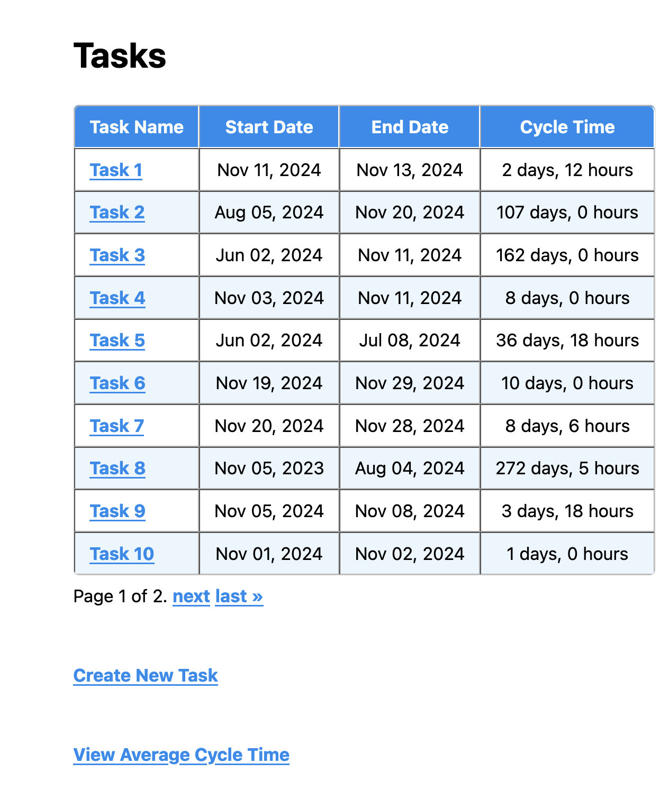
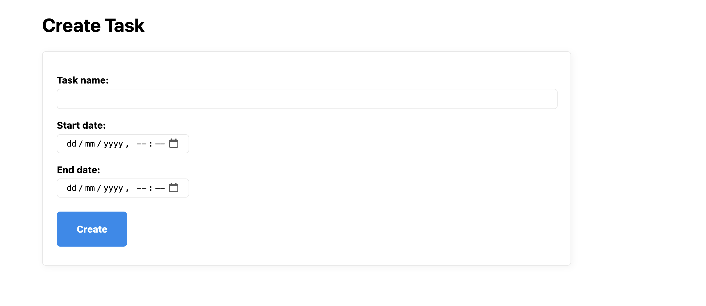
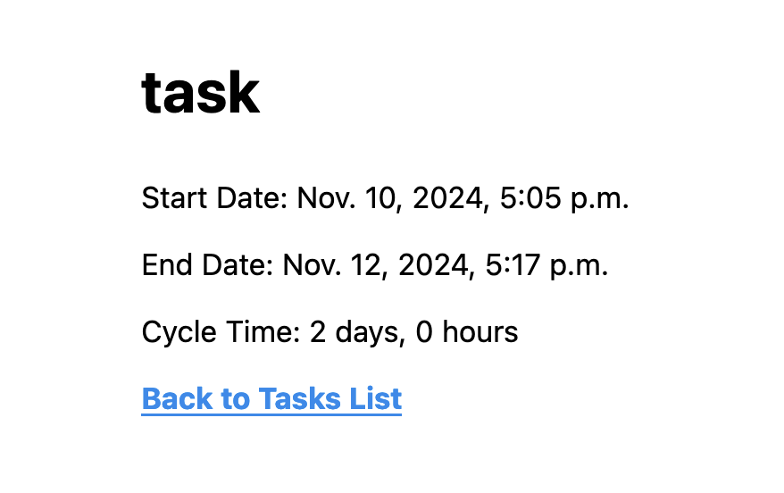
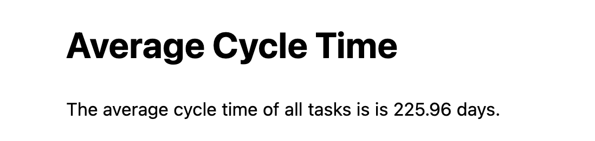
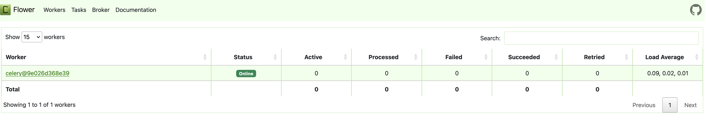
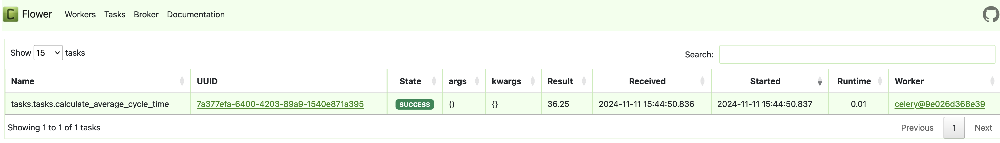
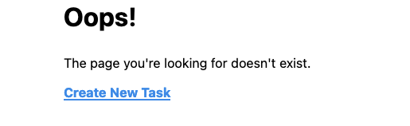
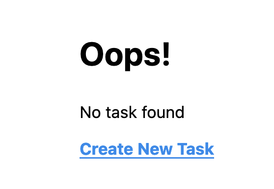

# Cycle Time Project

<!--toc:start-->

- [Cycle Time Project](#cycle-time-project)
  - [Running the Application with Docker](#running-the-application-with-docker)
    - [Viewing all tasks](#viewing-all-tasks)
    - [Creating a new Task](#creating-a-new-task)
    - [View Task by ID:](#view-task-by-id)
    - [Average Cycle Time](#average-cycle-time)
    - [404](#404)
  - [Design Decisions:](#design-decisions)
    - [Pagination](#pagination)
    - [Styling](#styling)
    - [Testing](#testing)
    - [Docker](#docker)
  - [Things I would implement if I had more time / knowledge of Django](#things-i-would-implement-if-i-had-more-time-knowledge-of-django)
  - [Styling:](#styling)
  - [Additional metrics and visualisation:](#additional-metrics-and-visualisation)
  - [Caching:](#caching)
  - [Learning and Documentation used:](#learning-and-documentation-used) - [Documentation used:](#documentation-used)
  <!--toc:end-->

## Running the Application with Docker

The entire application is dockerized as Celery, Redis and Flower are also being used. To note, I included the sqlite file so the information displayed in the screenshots is the same if you run the app. Additionally the Django secret key is still visible in settings.py file (however there is no encryption logic in this project) I've kept this in to ensure no build-related issues if repo is cloned.

First clone the repo and run:

```
docker compose build
```

then:

```
docker compose up -d
```

The container will run the django application, Celery, Redis and Flower.

#### Viewing all tasks

Go to localhost:8000/tasks/

Here you will see all tasks, including task name, start and end date, as well as the cycle time. The tasks are
paginated and users can go to the desired pages uses the corresponding links.


#### Creating a new Task

To create a new task press the "Create New Task" button or head to '/tasks/create', this will take you to a form that
creates a new task if the input fields are valid (I implemented additional validation on the Model class by overriding
the '.clean()' method - I did this so that not only will the form be validated but also when creating a new task when
using the admin dashboard - e.g. end date cannot be before the start date, and the start date/time and end date/time
cannot be the same).


#### View Task by ID:

You can view a single task by clicking the task name link in the table or by going to '/tasks/id', this will display the
task name, start and end date, and cycle time.


#### Average Cycle Time

When a new task is created, an asynchronous celery ask is also invoked, updating the average cycle time of all tasks.
Average cycle time is a Metric model that is calculated each time a new task is created.


Flower: to see the celery task being called, I used flower to see the worker and tasks. This can be viewed on localhost:
5555:


Average Cycle time was calculated getting the delta between the start and end date, then converting it to days and hours
and rendered using Django's template formatting for datetime. The implementation is a '@class_method' as we don't want the
calculation to be tied to one instance of a class but to all instances.

#### 404

I have also implemented 404 redirects and error handling for when a url is invalid, when there are no tasks, or when a
task (by id) does not exist.




## Design Decisions:

Note:
I have not used Django before this task.

I initially made the mistake of using Django Rest Framework first. Normally when creating a full stack application, I would create a robust CRUD API then a frontend.
So first I used DRF to create a CRUD API then had issues separating the frontend with templates without losing the json api view 'api/...' as that would defeat the purpose of using DRF. I re-read the requirements
and realised I had to build a 'django web application' as opposed to a REST API with a corresponding frontend. So I scrapped the implementation and started from scratch using just Django.

If you want to see the initial DRF API, view this repo:
https://github.com/DomDevs2000/MethodShift

#### Pagination

When implementing pagination, the average cycle time would not appear on the /tasks/ view (due to the celer task calc
implementation), so I had implemented it to its own page - before pagination it was viewable underneath the table.

#### Styling

For the styling I used a class-less CSS CDN framework:

https://andybrewer.github.io/mvp/

#### Testing

I had implemented unit tests to the model and views, such as average cycle time calculation, model validation, and error validation.
I decided to use pytest instead of django test only due to the fact I have used it previously and was more familiar with
it. However looking at the django testing document, django test seems more straightforward for this project.

#### Docker

I had decided to use docker due to the fact it negates any configuration or build issues on either side and can run
celery, flower and redis without the need to run these commands separately.

## Things I would implement if I had more time / knowledge of Django

### Styling:

I would use a more customisable styling framework such as tailwind etc.

### Additional metrics and visualisation:

I would implement additional metrics that a user can use, additionally I would've liked to create data visualisation for
these metrics (similar to Mission Control).

### Caching:

I had implemented caching on a GET all tasks request to cache, see 'caching'
branch: https://github.com/DomDevs2000/method_shift_tasks/tree/caching
using ` @cache_page` decorator but was unsure if this was necessary, implemented correctly and/or working due to my own
lack of log implementation, so I removed the caching implementation.

## Learning and Documentation used:

This was my first time using django so the main source of information was the django documentation, primarily walking
through the basic tutorial, then deviating to implement additional features such as Pagination, Model validation, Unit
Tests, Celery/Redis/Flower etc.
Since I had initially started building the REST API with DRF first, understanding how django worked (urls, models, views
etc.) was quite easy to pick up and reimplement to this repo.

### Documentation used:

Django Docs:
https://docs.djangoproject.com/en/5.1/intro/tutorial01/

Django Pagination:
https://docs.djangoproject.com/en/5.1/topics/pagination/

Pytest with Django
https://pytest-django.readthedocs.io/en/latest/

Implementing Celery with Django:
https://docs.celeryq.dev/en/stable/django/first-steps-with-django.html#using-celery-with-django

Using flower helped me debug the celery task, ensuring the worker was running and the task was being called:
https://flower.readthedocs.io/en/latest/
